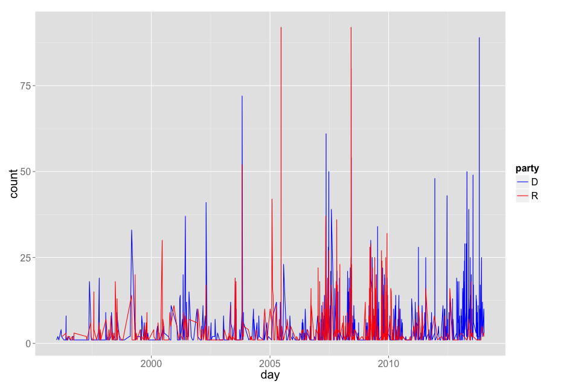
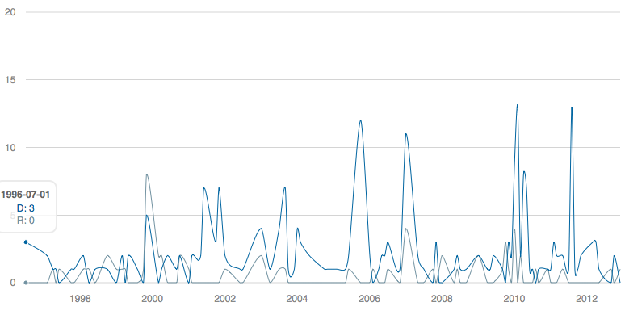

rsunlight
======

Linux: [](https://travis-ci.org/rOpenGov/rsunlight)
Windows: [](https://ci.appveyor.com/api/projects/status/ytc2qdo3u2t3ltm6/branch/master)

+ Maintainer: Scott Chamberlain
+ License: [MIT](http://creativecommons.org/publicdomain/zero/1.0/)
+ Report any problems in the [Issues Tracker](https://github.com/ropengov/rsunlight/issues), or just fork and submit changes, etc.

## Description

`rsunlight` is a collection of functions to search and acquire data from the various Sunlight Labs APIs for government data, at [http://sunlightfoundation.com/api/](http://sunlightfoundation.com/api/).

`rsunlight` wraps functions in APIs for:

* Congress API (`cg`)
* Open States API (`os`)
* Capitol Words API (`cw`)
* Influence Explorer API (`ie`)

Functions that wrap these sets of APIs will be prefixed by `cg`, `os`, `cw`, or `ie` for the different methods listed above:

* `cg` + `fxn`
* `os` + `fxn`
* `cw` + `fxn`
* `ie` + `fxn`

where `fxn` would be a function to a interface with a specific Sunlight Foundation API.

Please get your own API keys if you plant to use these functions for Sunlight Labs (http://sunlightfoundation.com/api/).

Data from the Sunlight Foundation API is provided by Sunlight Foundation.

<a border="0" href="http://sunlightfoundation.com/api/" ></a>

We set up the functions so that you can put the key in your .Rprofile file, which will be called on startup of R, and then you don't have to enter your API key for each run of a function. For example, put this in your `.Rprofile` file:

```
# key for API access to the Sunlight Labs API methods
options(SunlightLabsKey = "YOURKEYHERE")
```

**Note** that Puerto Rico is not included in Sunlight Foundation data.

## Quickstart

If you store your key in your `.Rprofile` file it will be read inside of each function call. Or you can pass your key into each function call manually by `key=yourkey`.

### Install rsunlight

```coffee
install.packages("devtools")
library(devtools)
install_github("ropengov/rsunlight")
```

### Load rsunlight

```coffee
library("rsunlight")
```

### Get districts for a latitude/longitude.

```coffee
(out <- cg_districts(latitude = 35.778788, longitude = -78.787805))
```

```coffee
$results
  state district
1    NC        2

$count
[1] 1
```

### Search congress people and senate members.

```coffee
out <- cg_legislators(last_name = 'Reed')
```

```coffee
$results
  bioguide_id   birthday chamber                               contact_form    crp_id district
1     R000585 1971-11-18   house https://reed.house.gov/contact-me/email-me N00030949       23
2     R000122 1949-11-12  senate        http://www.reed.senate.gov/contact/ N00000362       NA
      facebook_id          fax              fec_ids first_name gender govtrack_id icpsr_id in_office
1 102449199835273 202-226-6599            H0NY29054        Tom      M      412393    21101      TRUE
2 213866375370646 202-224-4680 S6RI00163, H0RI02071       John      M      300081    29142      TRUE
  last_name middle_name name_suffix nickname                  oc_email
1      Reed          W.          II     <NA> Rep.Reed@opencongress.org
2      Reed          F.        <NA>     Jack Sen.Reed@opencongress.org
                                  ocd_id                               office party        phone state
1 ocd-division/country:us/state:ny/cd:23 1504 Longworth House Office Building     R 202-225-3161    NY
2       ocd-division/country:us/state:ri      728 Hart Senate Office Building     D 202-224-4642    RI
    state_name   term_end term_start thomas_id title  twitter_id votesmart_id                    website
1     New York 2015-01-03 2013-01-03     01982   Rep  RepTomReed       127046      http://reed.house.gov
2 Rhode Island 2015-01-03 2009-01-06     00949   Sen SenJackReed        27060 http://www.reed.senate.gov
          youtube_id lis_id senate_class state_rank
1 CongressmanTomReed   <NA>           NA       <NA>
2        SenatorReed   S259            2     senior

$count
[1] 2

$page
$page$count
[1] 2

$page$per_page
[1] 20

$page$page
[1] 1
```

### Find the popularity of a phrase over a period of time.

Get a list of how many times the phrase "united states" appears in the Congressional Record in each month between January and June, 2010:

```coffee
cw_timeseries(phrase='united states', start_date='2009-01-01', end_date='2009-04-30', granularity='month')
```

```coffee
  count      month
1  3805 2009-01-01
2  3512 2009-02-01
3  6018 2009-03-01
4  2967 2009-04-01
```

#### Plot data

```coffee
library("ggplot2")
dat_d <- cw_timeseries(phrase='climate change', party="D")
dat_d$party <- rep("D", nrow(dat_d))
dat_r <- cw_timeseries(phrase='climate change', party="R")
dat_r$party <- rep("R", nrow(dat_r))
dat_both <- rbind(dat_d, dat_r)
ggplot(dat_both, aes(day, count, colour=party)) +
  geom_line() +
  theme_grey(base_size=20) +
  scale_colour_manual(values=c("blue","red"))
```



### Interactive charts using rCharts

Note that the resulting chart opens in a browser, so is not shown in this vignette, but you will see it open in a browser when you run the code.

```coffee
dream <- lapply(c('D','R'), function(x) cw_timeseries(phrase='i have a dream', party=x, start_date='1996-01-01', end_date='2013-01-01', granularity='month'))
df <- merge(dream[[1]], dream[[2]], by='month', all=TRUE)
df[is.na(df)] <- 0
names(df) <- c('date','D','R')
df$date <- as.character(df$date)
```

```coffee
library(rCharts)
m1 <- mPlot(x = "date", y = c("D", "R"), type = "Line", data = df)
m1$set(pointSize = 0, lineWidth = 1)
m1
```

_note: as you can see this is not actually interactive, but when you make it, it will be_



### Return the top contributing organizations

Ranked by total dollars given. An organization's giving is broken down into money given directly (by the organization's PAC) versus money given by individuals employed by or associated with the organization.

```coffee
ie_industries(method='top_ind', limit=4)
```

```coffee
count        amount                               id should_show_entity                   name
1 14919818 3825359507.21 cdb3f500a3f74179bb4a5eb8b2932fa6               TRUE                UNKNOWN
2  3600761 2787678962.95 f50cf984a2e3477c8167d32e2b14e052               TRUE      LAWYERS/LAW FIRMS
3   329906 1717649914.58 9cac88377c3b400e89c2d6762e3f28f6               TRUE CANDIDATE SELF-FINANCE
4  1386613 1707457092.04 7500030dffe24844aa467a75f7aedfd1               TRUE            REAL ESTATE
```
