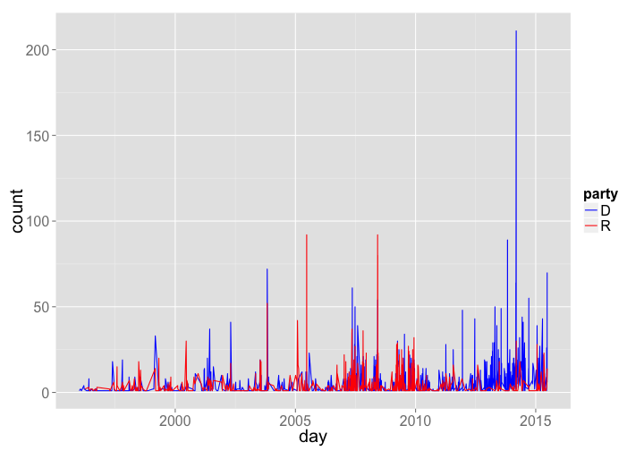

rsunlight
======


[](https://travis-ci.org/rOpenGov/rsunlight)
[](https://ci.appveyor.com/project/sckott/rsunlight)
[](https://github.com/metacran/cranlogs.app)
[](http://cran.rstudio.com/web/packages/rsunlight)

+ Maintainer: [Scott Chamberlain](https://github.com/sckott/)
+ License: [MIT](http://opensource.org/licenses/MIT)
+ Report any problems in the [Issues Tracker](https://github.com/ropengov/rsunlight/issues), or just fork and submit changes, etc.

## Description

`rsunlight` is a collection of functions to search and acquire data from the various Sunlight Labs APIs for government data, at [http://sunlightfoundation.com/api/](http://sunlightfoundation.com/api/).

`rsunlight` wraps functions in APIs for:

* Congress API (`cg`)
* Open States API (`os`)
* Capitol Words API (`cw`)
* Influence Explorer API (`ie`)

Functions that wrap these sets of APIs will be prefixed by `cg`, `os`, `cw`, or `ie` for the different methods listed above:

* `cg` + `fxn`
* `os` + `fxn`
* `cw` + `fxn`
* `ie` + `fxn`

where `fxn` would be a function to a interface with a specific Sunlight Foundation API.

Please get your own API keys if you plant to use these functions for Sunlight Labs (http://sunlightfoundation.com/api/).

Data from the Sunlight Foundation API is provided by Sunlight Foundation.

<a href="http://sunlightfoundation.com/api/"></a>

You need API keys for Sunlight Foundation APIs. Please get your own API keys if you
plant to use these functions for Sunlight Labs (http://services.sunlightlabs.com/).
We set up the functions so that you can use either env vars, or R options. For env
vars, put an entry in your `.Renviron` file with the name `SUNLIGHT_LABS_KEY`,
so the full thing would be `SUNLIGHT_LABS_KEY=<key>`. For R options, put the key in
your `.Rprofile` file like `options(SunlightLabsKey = "key")`. Both are called
on R startup, and then you don't have to enter your API key for each run of a function.

**Note** that Puerto Rico is not included in Sunlight Foundation data.

## Install rsunlight

From CRAN


```r
install.packages("rsunlight")
```

Or development version from Github


```r
devtools::install_github("ropengov/rsunlight")
```


```r
library("rsunlight")
```

## Congress API

### Get districts for a latitude/longitude.


```r
cg_districts(latitude = 35.778788, longitude = -78.787805)
#> <Sunlight data>
#>    Dimensions:   [1 X 2]
#> 
#>   state district
#> 1    NC        2
```

### Search congress people and senate members.


```r
out <- cg_legislators(last_name = 'Reed')
```

## Open States API

### Bill Search 

Search for bills with the term _agriculture_, in Texas, and in the upper chamber. 


```r
os_billsearch(terms = 'agriculture', state = 'tx', chamber = 'upper')
#> <Sunlight data>
#>    Dimensions:   [320 X 10]
#> 
#>                                                                          title
#> 1  Relating to certain committees and programs to develop the wine industry in
#> 2  Relating to a waiver of fees by the Department of Agriculture and the Parks
#> 3  Urging the United States Department of Agriculture Food and Nutrition Servi
#> 4  Relating to the designation of an office in the Department of Agriculture t
#> 5  Relating to the office of water and the water advisory committee in the Dep
#> 6  Relating to establishing an agriculture ombudsman office in the Department 
#> 7  Relating to authorizing the issuance of revenue bonds to fund capital proje
#> 8  Relating to authorizing the issuance of revenue bonds to fund capital proje
#> 9  Relating to authorizing the issuance of revenue bonds to fund capital proje
#> 10 Relating to authorizing the issuance of revenue bonds to fund capital proje
#> ..                                                                         ...
#> Variables not shown: created_at (chr), updated_at (chr), id (chr), chamber
#>      (chr), state (chr), session (chr), type (list), subjects (list),
#>      bill_id (chr)
```

### Legislator Search

Search for Republican legislators in Nevada


```r
os_legislatorsearch(state = 'nv', party = 'republican')
#> <Sunlight data>
#>    Dimensions:   [36 X 26]
#> 
#>    last_name                                               all_ids
#> 1    O'Neill                       NVL000291, NVL000355, NVL000358
#> 2    Dooling                                  NVL000273, NVL000319
#> 3      Fiore                                  NVL000252, NVL000297
#> 4    Edwards                                  NVL000287, NVL000345
#> 5   Hambrick NVL000082, NVL000040, NVL000178, NVL000226, NVL000321
#> 6   Woodbury NVL000105, NVL000063, NVL000200, NVL000234, NVL000320
#> 7    Gardner                                  NVL000290, NVL000329
#> 8     Nelson                                  NVL000270, NVL000293
#> 9     Kirner NVL000131, NVL000186, NVL000186, NVL000240, NVL000298
#> 10 Armstrong                                  NVL000292, NVL000313
#> ..       ...                                                   ...
#>                full_name
#> 1  Philip "P.K." O'Neill
#> 2    Victoria A. Dooling
#> 3          Michele Fiore
#> 4          Chris Edwards
#> 5          John Hambrick
#> 6       Melissa Woodbury
#> 7       David M. Gardner
#> 8        Erven T. Nelson
#> 9           Randy Kirner
#> 10       Derek Armstrong
#> ..                   ...
#> Variables not shown: id (chr), first_name (chr), middle_name (chr),
#>      district (chr), state (chr), party (chr), updated_at (chr), leg_id
#>      (chr), active (lgl), photo_url (chr), created_at (chr), chamber
#>      (chr), offices (list), suffixes (chr), email (chr),
#>      transparencydata_id (chr), nickname (chr), url (chr), votesmart_id
#>      (chr), country (chr), level (chr), +address (chr),
#>      csrfmiddlewaretoken (chr)
```


## Capitol Words API

### Find the popularity of a phrase over a period of time.

Get a list of how many times the phrase "united states" appears in the Congressional Record in each month between January and June, 2010:


```r
cw_timeseries(phrase='united states', start_date='2009-01-01', end_date='2009-04-30', granularity='month')
#> <Sunlight data>
#>    Dimensions:   [4 X 2]
#> 
#>   count      month
#> 1  3805 2009-01-01
#> 2  3512 2009-02-01
#> 3  6018 2009-03-01
#> 4  2967 2009-04-01
```


```r
library("ggplot2")
dat_d <- cw_timeseries(phrase='climate change', party="D")
dat_d$party <- rep("D", nrow(dat_d))
dat_r <- cw_timeseries(phrase='climate change', party="R")
dat_r$party <- rep("R", nrow(dat_r))
dat_both <- rbind(dat_d, dat_r)
ggplot(dat_both, aes(day, count, colour=party)) +
  geom_line() +
  theme_grey(base_size=20) +
  scale_colour_manual(values=c("blue","red"))
```

 

## Influence Explorer API

### Return the top contributing organizations

Ranked by total dollars given. An organization's giving is broken down into money given directly (by the organization's PAC) versus money given by individuals employed by or associated with the organization.


```r
ie_industries(method = 'top_ind', limit = 4)
#>      count        amount                               id
#> 1 14920072 3825432715.21 cdb3f500a3f74179bb4a5eb8b2932fa6
#> 2  3706621 2892170142.95 f50cf984a2e3477c8167d32e2b14e052
#> 3  1441992 1807645239.04 7500030dffe24844aa467a75f7aedfd1
#> 4   821204 1728183840.57 0af3f418f426497e8bbf916bfc074ebc
#>   should_show_entity                    name
#> 1               TRUE                 UNKNOWN
#> 2               TRUE       LAWYERS/LAW FIRMS
#> 3               TRUE             REAL ESTATE
#> 4               TRUE SECURITIES & INVESTMENT
```
