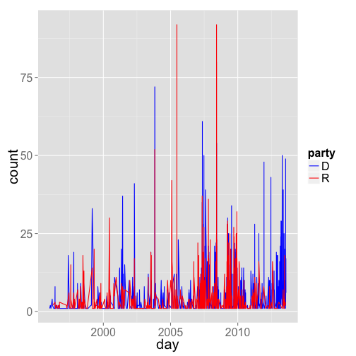

<!--
%\VignetteEngine{knitr}
%\VignetteIndexEntry{An R Markdown Vignette made with knitr}
-->

govdat vignette - Interface to various APIs for government data.
======

### About the package

`govdat` is an R package to search and retrieve data from two sets of APIs, the Sunlight Labs APIs, andn the New York Times congress API. 


Returned objects from functions are simple lists. That is, you likely will want to take output objects and make data.frames, vectors, matrices, etc. In future versions of govdat, I will return data.frame's when possible as those are easy to work with in R for beginners, though advanced users probably like lists more (I'm guessing, or just the raw JSON, eh)?

The following are examples of using the Sunlight Labs API. I will add examples of using the New York Times Congress API once their site is up again; I'm doing this on 2013-08-28, just after the takedown of their site due to hackers.

********************


#### Install govdat


```r
install.packages("devtools")
library(devtools)
install_github("govdat", "schamberlain")
```


********************

#### Load govdat and other dependency libraries


```r
library(govdat)
```


********************

### SunlightLabs Data

********************

#### Gets details (subcommittees + membership) for a committee by id.


```r
library(govdat)
key <- getOption("SunlightLabsKey")
out <- sll_cg_getcommittees(id = "JSPR", key = sunlightkey)
out$response$committee$members[[1]]$legislator[1:5]
```

```
$website
[1] "http://www.alexander.senate.gov"

$fax
[1] "202-228-3398"

$govtrack_id
[1] "300002"

$firstname
[1] "Lamar"

$chamber
[1] "senate"
```


********************

#### Gets a list of all committees that a member serves on, including subcommittes.


```r
out <- sll_cg_getcommitteesallleg(bioguide_id = "S000148", key = sunlightkey)
out$response$committees[[1]]
```

```
$committee
$committee$chamber
[1] "Senate"

$committee$id
[1] "SSRA"

$committee$name
[1] "Senate Committee on Rules and Administration"
```


********************

#### Get districts for a latitude/longitude.


```r
out <- sll_cg_getdistrictlatlong(latitude = 35.778788, longitude = -78.787805, 
    key = sunlightkey)
out$response$districts
```

```
[[1]]
[[1]]$district
[[1]]$district$state
[1] "NC"

[[1]]$district$number
[1] "2"
```


********************

#### Get districts that overlap for a certain zip code.


```r
out <- sll_cg_getdistrictzip(zip = 27511, key = sunlightkey)
out$response$districts
```

```
[[1]]
[[1]]$district
[[1]]$district$state
[1] "NC"

[[1]]$district$number
[1] "2"


[[2]]
[[2]]$district
[[2]]$district$state
[1] "NC"

[[2]]$district$number
[1] "4"


[[3]]
[[3]]$district
[[3]]$district$state
[1] "NC"

[[3]]$district$number
[1] "13"
```


********************

#### Search congress people and senate members.


```r
out <- sll_cg_getlegislatorsearch(name = "Reed", key = sunlightkey)
out$response$results[[1]]$result$legislator[1:5]
```

```
$website
[1] "http://reed.house.gov"

$fax
[1] "202-226-6599"

$govtrack_id
[1] "412393"

$firstname
[1] "Tom"

$chamber
[1] "house"
```


********************

#### Search congress people and senate members for a zip code.


```r
out <- sll_cg_legislatorsallforzip(zip = 77006, key = sunlightkey)
library(plyr)
ldply(out$response$legislators, function(x) data.frame(x$legislator[c("firstname", 
    "lastname")]))
```

```
  firstname    lastname
1    Sheila Jackson Lee
2       Ted        Cruz
3      John      Cornyn
4       Ted         Poe
```


********************

#### Find the popularity of a phrase over a period of time.

##### Get a list of how many times the phrase "united states" appears in the Congressional Record in each month between January and June, 2010:


```r
sll_cw_timeseries(phrase = "united states", start_date = "2009-01-01", end_date = "2009-04-30", 
    granularity = "month", key = sunlightkey)
```

```
4 records returned
```

```
  count      month
1  3805 2009-01-01
2  3512 2009-02-01
3  6018 2009-03-01
4  2967 2009-04-01
```


##### Plot data


```r
library(ggplot2)
dat <- sll_cw_timeseries(phrase = "climate change", key = sunlightkey)
```

```
1354 records returned
```

```r
ggplot(dat, aes(day, count)) + geom_line() + theme_grey(base_size = 20)
```

 


##### Plot more data


```r
dat_d <- sll_cw_timeseries(phrase = "climate change", party = "D", key = sunlightkey)
```

```
908 records returned
```

```r
dat_d$party <- rep("D", nrow(dat_d))
dat_r <- sll_cw_timeseries(phrase = "climate change", party = "R", key = sunlightkey)
```

```
623 records returned
```

```r
dat_r$party <- rep("R", nrow(dat_r))
dat_both <- rbind(dat_d, dat_r)
ggplot(dat_both, aes(day, count, colour = party)) + geom_line() + theme_grey(base_size = 20) + 
    scale_colour_manual(values = c("blue", "red"))
```

 


#### Interactive charts using rCharts


```r
dream <- lapply(c("D", "R"), function(x) sll_cw_timeseries(phrase = "i have a dream", 
    party = x, start_date = "1996-01-01", end_date = "2013-01-01", granularity = "month", 
    key = sunlightkey))
df <- merge(dream[[1]], dream[[2]], by = "month", all = TRUE)
df[is.na(df)] <- 0
names(df) <- c("date", "D", "R")
df$date <- as.character(df$date)
# df <- ldply(dream, data.frame)

library(rCharts)
m1 <- mPlot(x = "date", y = c("D", "R"), type = "Line", data = df)
m1$set(pointSize = 0, lineWidth = 1)
m1
```


********************

#### Search OpenStates bills.


```r
out <- sll_os_billsearch(terms = "agriculture", state = "tx", chamber = "upper", 
    key = sunlightkey)
lapply(out, "[[", "title")[100:110]
```

```
[[1]]
[1] "Relating to the sale by the Brazos River Authority of certain property at Possum Kingdom Lake."

[[2]]
[1] "Proposing a constitutional amendment providing immediate additional revenue for the state budget by creating the Texas Gaming Commission, and authorizing and regulating the operation of casino games and slot machines by a limited number of licensed operators and certain Indian tribes."

[[3]]
[1] "Relating to production requirements for holders of winery permits."

[[4]]
[1] "Relating to the use of human remains in the training of search and rescue animals."

[[5]]
[1] "Relating to end-of-course assessment instruments administered to public high school students and other measures of secondary-level performance."

[[6]]
[1] "Relating to public high school graduation, including curriculum and assessment requirements for graduation and funding in support of certain curriculum authorized for graduation."

[[7]]
[1] "Relating to certain residential and other structures and mitigation of loss to those structures resulting from natural catastrophes; providing a criminal penalty."

[[8]]
[1] "Recognizing March 28, 2013, as Texas Water Conservation Day at the State Capitol."

[[9]]
[1] "Recognizing March 26, 2013, as Lubbock Day at the State Capitol."

[[10]]
[1] "In memory of Steve Jones."

[[11]]
[1] "Relating to the regulation of dangerous wild animals."
```


********************

#### Search Legislators on OpenStates. 


```r
out <- sll_os_legislatorsearch(state = "tx", party = "democratic", active = TRUE, 
    key = sunlightkey)
out[[1]][1:4]
```

```
$last_name
[1] "Naishtat"

$updated_at
[1] "2013-08-30 02:56:59"

$nimsp_candidate_id
[1] "112047"

$full_name
[1] "Elliott Naishtat"
```


********************

#### Search for entities - that is, politicians, individuals, or organizations with the given name


```r
out <- sll_ts_aggregatesearch("Nancy Pelosi", key = sunlightkey)
out <- lapply(out, function(x) {
    x[sapply(x, is.null)] <- "none"
    x
})
ldply(out, data.frame)
```

```
                       name count_given firm_income count_lobbied
1          Nancy Pelosi (D)           0           0             0
2 Nancy Pelosi for Congress           7           0             0
           seat total_received state lobbying_firm count_received party
1 federal:house       14173534    CA          none          10054     D
2          none              0  none          <NA>              0  none
  total_given         type                               id
1           0   politician 85ab2e74589a414495d18cc7a9233981
2        7250 organization afb432ec90454c8a83a3113061e7be27
  non_firm_spending is_superpac
1                 0        none
2                 0        <NA>
```


********************

#### Return the top contributoring organizations, ranked by total dollars given. An organization's giving is broken down into money given directly (by the organization's PAC) versus money given by individuals employed by or associated with the organization.


```r
out <- sll_ts_aggregatetopcontribs(id = "85ab2e74589a414495d18cc7a9233981", 
    key = sunlightkey)
ldply(out, data.frame)
```

```
   employee_amount total_amount total_count
1         64000.00    101300.00          79
2          3500.00     90000.00          29
3                0     86600.00          48
4                0     85000.00          32
5                0     82500.00          37
6                0     77000.00          19
7                0     76000.00          36
8                0     72500.00          18
9                0     72500.00          21
10         8000.00     72000.00          31
                                       name direct_count employee_count
1                          Akin, Gump et al           16             63
2  American Fedn of St/Cnty/Munic Employees           25              4
3                 National Assn of Realtors           48              0
4                       United Auto Workers           32              0
5                   National Education Assn           37              0
6                           Teamsters Union           19              0
7          National Assn of Letter Carriers           36              0
8    Intl Brotherhood of Electrical Workers           18              0
9                 Sheet Metal Workers Union           21              0
10                              Wells Fargo           20             11
                                 id direct_amount
1  105dcfc8c9384875a099af230dad9917      37300.00
2  fb702029157e4c7c887172eba71c66c5      86500.00
3  bb98402bd4d3471cad392a671ecd733a      86600.00
4  4d3167b97c9f48deb433aad57bb0ee44      85000.00
5  1b8fea7e453d4e75841eac48ff9df550      82500.00
6  f89c8e3ab2b44f72971f91b764868231      77000.00
7  390767dc6b4b491ca775b1bdf8a36eea      76000.00
8  b53b4ad137d743a996f4d7467700fc88      72500.00
9  425be85642b24cc2bc3d8a0bb3c7bc92      72500.00
10 793070ae7f5e42c2a76a58663a588f3d      64000.00
```


### New York Times Congress API

*Note: Member ID S001181 is Jeanne Shaheen*

#### Get bill cosponsorship data for a particular member.


```r
out <- nyt_cg_billscosponsor(memberid = "S001181", type = "cosponsored", key = nytimeskey)
ldply(out$results[[1]]$bills, function(x) data.frame(x[c("number", "cosponsors")]))
```

```
         number cosponsors
1         S.642          6
2     S.RES.212         99
3        S.1431         16
4        S.1426          6
5        S.1422          4
6         S.323         15
7        S.1158         30
8  S.CON.RES.13         10
9         S.809         13
10       S.1123         23
11       S.1332          2
12    S.RES.205         17
13        S.557         23
14       S.1366          2
15        S.370         18
16        S.629         22
17        S.734         24
18        S.119         13
19        S.234         20
20        S.569         16
```


#### Get information about a particular member's appearances on the House or Senate floor.


```r
library(plyr)
out <- nyt_cg_memberappear(memberid = "S001181", key = nytimeskey)
ldply(out$results[[1]]$appearances, function(x) data.frame(x[c("date", "title")]))
```

```
         date
1  2010-09-29
2  2010-09-22
3  2010-09-17
4  2010-09-16
5  2010-08-03
6  2010-07-29
7  2010-07-28
8  2010-07-22
9  2010-07-21
10 2010-07-21
11 2010-07-20
12 2010-07-15
13 2010-07-15
14 2010-06-30
15 2010-06-29
16 2010-06-23
17 2010-06-17
18 2010-06-16
19 2010-06-10
20 2010-06-09
                                                              title
1                                            Senate Session, Part 2
2                                                    Senate Session
3  Judge Porteous Impeachment Trial, Rafael Pardo Testimony, Part 2
4      Judge Porteous Impeachment Trial, Claude Lightfoot Testimony
5                                            Senate Session, Part 2
6                                                    Senate Session
7                                                    Senate Session
8                                                    Senate Session
9                                                    Senate Session
10                                        Ambassadorial Nominations
11                                           Senate Session, Part 1
12                                                   Senate Session
13                                               Afghanistan Issues
14                                                   Senate Session
15                                           Senate Session, Part 2
16                                          U.S. Policy Toward Iran
17                                                   Senate Session
18                                           Senate Session, Part 1
19                                                   Senate Session
20                                 Offshore Oil Drilling Regulation
```


#### Get a list of the most recent new members of the current Congress.


```r
out <- nyt_cg_memberbystatedistrict(chamber = "senate", state = "NH", key = nytimeskey)
lapply(out$results, "[[", "name")
```

```
[[1]]
[1] "Jeanne Shaheen"

[[2]]
[1] "Kelly Ayotte"
```


#### Compare bill sponsorship between two members who served in the same Congress and chamber.


```r
out <- nyt_cg_membersponsorcompare(memberid_1 = "S001181", memberid_2 = "A000368", 
    congress_no = 112, chamber = "senate", key = nytimeskey)
library(plyr)
ldply(out$results[[1]]$bills, function(x) data.frame(x[c("number", "title")]))[1:5, 
    ]
```

```
Error: $ operator is invalid for atomic vectors
```


#### Get a specific roll-call vote, including a complete list of member positions.

This creates a simple plot - but you can imagine creating better plots yourself.


```r
out <- nyt_cg_rollcallvote(congress_no = 112, chamber = "house", session_no = 1, 
    rollcall_no = 235, key = nytimeskey)
df <- ldply(out$results$votes$vote$positions, data.frame)
```

```
Error: $ operator is invalid for atomic vectors
```

```r

# Attach names to the data.frame
nms <- nyt_cg_memberslist(congress_no = 112, chamber = "house", key = nytimeskey)
nmsdf <- ldply(nms$results[[1]]$members, function(x) data.frame(x[c("id", "first_name", 
    "last_name", "party")]))
```

```
Error: $ operator is invalid for atomic vectors
```

```r
nmsdf <- transform(nmsdf, name = paste(first_name, last_name))[, c(1, 4, 5)]
```

```
Error: object 'nmsdf' not found
```

```r
df2 <- merge(df, nmsdf, by.x = "member_id", by.y = "id")
```

```
Error: object 'nmsdf' not found
```

```r
head(df2)
```

```
Error: object 'df2' not found
```

```r

# Plot results
library(ggplot2)
ggplot(df2, aes(x = party, fill = vote_position)) + geom_bar()
```

```
Error: object 'df2' not found
```

