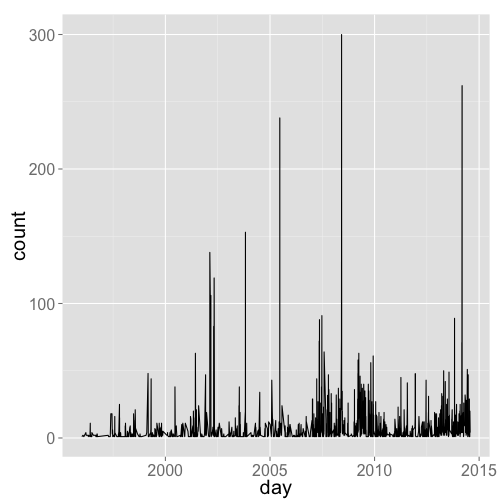
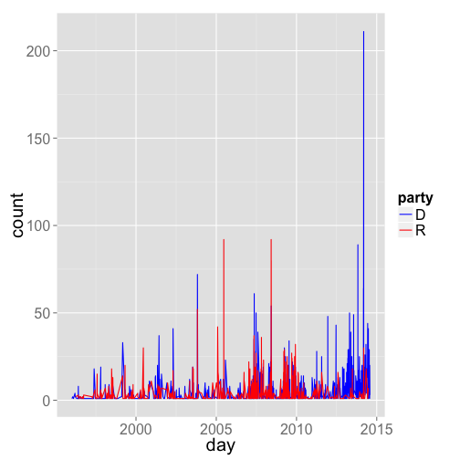

<!--
%\VignetteEngine{knitr}
%\VignetteIndexEntry{rsunlight vignette}
-->

rsunlight vignette - Interface to Sunlight Labs APIs.
======

### About the package

`rsunlight` is an R package to search and retrieve data from the Sunlight Labs APIs. 

Returned objects from functions are simple lists. That is, you likely will want to take output objects and make data.frames, vectors, matrices, etc. In future versions of rsunlight, I will return data.frame's when possible as those are easy to work with in R for beginners, though advanced users may prefer lists or raw responses from the API with lots of info, including header, etc.

********************


#### Install rsunlight


```r
install.packages("devtools")
library('devtools')
install_github("rsunlight", "ropengov")
```

********************

#### Load rsunlight and other dependency libraries


```r
library('rsunlight')
```

********************

#### Gets details (subcommittees + membership) for a committee by id.


```r
out <- cg_committees(id = 'JSPR')
head(out$results)
```

```
##   chamber committee_id
## 1  senate       SSGA16
## 2  senate       SSGA15
## 3  senate       SSGA17
## 4  senate       SSGA01
## 5  senate       SSFR13
## 6  senate       SSFR12
##                                                                                                                          name
## 1                                              the Efficiency and Effectiveness of Federal Programs and the Federal Workforce
## 2                                                                                         Financial and Contracting Oversight
## 3                                             Emergency Management, Intergovernmental Relations, and the District of Columbia
## 4                                                                                    Permanent Subcommittee on Investigations
## 5                              International Operations and Organizations, Human Rights, Democracy, and Global Women's Issues
## 6 International Development and Foreign Assistance, Economic Affairs, International Environmental Protection, and Peace Corps
##   parent_committee_id subcommittee
## 1                SSGA         TRUE
## 2                SSGA         TRUE
## 3                SSGA         TRUE
## 4                SSGA         TRUE
## 5                SSFR         TRUE
## 6                SSFR         TRUE
```

********************

#### Get districts for a latitude/longitude.


```r
cg_districts(latitude = 35.778788, longitude = -78.787805)
```

```
## $results
##   state district
## 1    NC        2
## 
## $count
## [1] 1
```

********************

#### Get districts that overlap for a certain zip code.


```r
cg_districts(zip = 27511)
```

```
## $results
##   state district
## 1    NC        2
## 2    NC        4
## 3    NC       13
## 
## $count
## [1] 3
```

********************

#### Search politicians by name


```r
out <- cg_legislators(last_name = 'Reed')
head(out$results)
```

```
##   bioguide_id   birthday chamber
## 1     R000585 1971-11-18   house
## 2     R000122 1949-11-12  senate
##                                 contact_form    crp_id district
## 1 https://reed.house.gov/contact-me/email-me N00030949       23
## 2        http://www.reed.senate.gov/contact/ N00000362       NA
##       facebook_id          fax              fec_ids first_name gender
## 1 102449199835273 202-226-6599            H0NY29054        Tom      M
## 2 213866375370646 202-224-4680 S6RI00163, H0RI02071       John      M
##   govtrack_id icpsr_id in_office last_name middle_name name_suffix
## 1      412393    21101      TRUE      Reed          W.          II
## 2      300081    29142      TRUE      Reed          F.        <NA>
##   nickname                  oc_email
## 1     <NA> Rep.Reed@opencongress.org
## 2     Jack Sen.Reed@opencongress.org
##                                   ocd_id
## 1 ocd-division/country:us/state:ny/cd:23
## 2       ocd-division/country:us/state:ri
##                                 office party        phone state
## 1 1504 Longworth House Office Building     R 202-225-3161    NY
## 2      728 Hart Senate Office Building     D 202-224-4642    RI
##     state_name   term_end term_start thomas_id title  twitter_id
## 1     New York 2015-01-03 2013-01-03     01982   Rep  RepTomReed
## 2 Rhode Island 2015-01-03 2009-01-06     00949   Sen SenJackReed
##   votesmart_id                    website         youtube_id lis_id
## 1       127046      http://reed.house.gov CongressmanTomReed   <NA>
## 2        27060 http://www.reed.senate.gov        SenatorReed   S259
##   senate_class state_rank
## 1           NA       <NA>
## 2            2     senior
```

********************

#### Search politicians by zip code

And get their names and Twitter handles


```r
out <- cg_legislators(zip = 77006)
out$results[,c('last_name','first_name','twitter_id')]
```

```
##     last_name first_name     twitter_id
## 1        Cruz        Ted     SenTedCruz
## 2         Poe        Ted    JudgeTedPoe
## 3 Jackson Lee     Sheila JacksonLeeTX18
## 4      Cornyn       John     JohnCornyn
```

********************

#### Popularity of a phrase through time.

Get a list of how many times the phrase "united states" appears in the Congressional Record in each month between January and June, 2010:


```r
cw_timeseries(phrase='united states', start_date='2009-01-01', end_date='2009-04-30', granularity='month')
```

```
##   count      month
## 1  3805 2009-01-01
## 2  3512 2009-02-01
## 3  6018 2009-03-01
## 4  2967 2009-04-01
```

##### Plot data


```r
library('ggplot2')
dat <- cw_timeseries(phrase='climate change')
ggplot(dat, aes(day, count)) + 
  geom_line() + 
  theme_grey(base_size=20)
```

 

##### Plot more data


```r
dat_d <- cw_timeseries(phrase='climate change', party="D")
dat_d$party <- rep("D", nrow(dat_d))
dat_r <- cw_timeseries(phrase='climate change', party="R")
dat_r$party <- rep("R", nrow(dat_r))
dat_both <- rbind(dat_d, dat_r)
ggplot(dat_both, aes(day, count, colour=party)) + 
  geom_line() + 
  theme_grey(base_size=20) + 
  scale_colour_manual(values=c("blue","red"))
```

 

#### Interactive charts

Note that the resulting chart opens in a browser, so is not shown in this vignette, but you will see it open in a browser when you run the code.


```r
dream <- lapply(c('D','R'), function(x) cw_timeseries(phrase='i have a dream', party=x, start_date='1996-01-01', end_date='2013-01-01', granularity='month'))
df <- merge(dream[[1]], dream[[2]], by='month', all=TRUE)
df[is.na(df)] <- 0
names(df) <- c('date','D','R')
df$date <- as.character(df$date)

library('rCharts')
m1 <- mPlot(x = "date", y = c("D", "R"), type = "Line", data = df)
m1$set(pointSize = 0, lineWidth = 1)
m1
```

********************

#### Search OpenStates bills.


```r
out <- os_billsearch(terms = 'agriculture', state = 'tx', chamber = 'upper')
out$title[1:10]
```

```
##  [1] "Relating to authorizing the issuance of revenue bonds to fund capital projects at public institutions of higher education; making an appropriation."
##  [2] "Relating to authorizing the issuance of revenue bonds to fund capital projects at public institutions of higher education."                         
##  [3] "Relating to authorizing the issuance of revenue bonds to fund capital projects at public institutions of higher education."                         
##  [4] "Relating to authorizing the issuance of revenue bonds to fund capital projects at public institutions of higher education."                         
##  [5] "Relating to authorizing the issuance of revenue bonds to fund capital projects at public institutions of higher education; making an appropriation."
##  [6] "Relating to access to certain facilities by search and rescue dogs and their handlers; providing a criminal penalty."                               
##  [7] "Relating to fever tick eradication; creating a penalty."                                                                                            
##  [8] "Relating to the Texas Military Preparedness Commission and strategic planning regarding military bases and defense installations."                  
##  [9] "Relating to certain economic development programs administered by the Department of Agriculture."                                                   
## [10] "Relating to the regulation and practice of veterinary medicine; authorizing a fee."
```

********************

#### Search Legislators on OpenStates


```r
out <- os_legislatorsearch(state = 'tx', party = 'democratic', active = TRUE)
head(out[,c('full_name','state','district')])
```

```
##              full_name state district
## 1     Armando Martinez    tx       39
## 2 Ruth Jones McClendon    tx      120
## 3        Terry Canales    tx       40
## 4         Joseph Moody    tx       78
## 5         Joe Deshotel    tx       22
## 6      Borris L. Miles    tx      146
```

********************

#### Search for entities

That is, politicians, individuals, or organizations with the given name


```r
out <- ie_entities('Nancy Pelosi')
out
```

```
##                        name count_given firm_income count_lobbied
## 1          Nancy Pelosi (D)           0           0             0
## 2 Nancy Pelosi for Congress           7           0             0
##            seat total_received state lobbying_firm count_received party
## 1 federal:house       14731364    CA            NA          10321     D
## 2          <NA>              0  <NA>         FALSE              0  <NA>
##   total_given         type                               id
## 1           0   politician 85ab2e74589a414495d18cc7a9233981
## 2        7250 organization afb432ec90454c8a83a3113061e7be27
##   non_firm_spending is_superpac
## 1                 0          NA
## 2                 0          NA
```

********************

#### Contributions by industries

Return the top contributoring companies by industry, ranked by total dollars given. The `entity_id` of `ba400a177400497680cac90f678ecb8f` is the identifier for _oil and gas_.


```r
ie_industries(method='top_org', entity_id='ba400a177400497680cac90f678ecb8f')
```

```
##    employee_amount total_amount total_count                         name
## 1       1686382.70   4198380.29        2767            Chesapeake Energy
## 2       2736266.00   2788916.00         247              Chief Oil & Gas
## 3                0   2521532.64         498  TEXAS OIL & GAS ASSOCIATION
## 4        302130.38   2145832.38        3139                 Marathon Oil
## 5        832984.00   1574534.00        1074         Occidental Petroleum
## 6        922226.00   1532870.00        1302                     USX Corp
## 7       1253908.87   1253908.87         120           Hyperion Resources
## 8       1107871.62   1107871.62         275           Beecherl Companies
## 9       1105536.00   1105536.00         664        Oil & Gas Investments
## 10       750513.24   1025628.79         821 American Petroleum Institute
##    direct_count employee_count                               id
## 1          1983            784 4966257e103a45f5b13d901058b0c0be
## 2            34            213 f2df5e19f0b449beb19c4d3b7f062245
## 3           498              0 820a996e87254cfbac33884434150ce0
## 4          2758            381 894b0134033448daa5208aa97455575b
## 5           815            259 74f871b3928c49d39d004c08aec1e2a2
## 6           814            488 8e95d7fa12f74aa387b2c880fb20df65
## 7             0            120 8d348514c5484120b05ee75929650534
## 8             0            275 5d92d3d625f8422db0d630f2ef9693c7
## 9             0            664                             <NA>
## 10          195            626 83bfbee9757c42308f4c7d0598cbdce3
##    direct_amount
## 1     2511997.59
## 2       52650.00
## 3     2521532.64
## 4     1843702.00
## 5      741550.00
## 6      610644.00
## 7              0
## 8              0
## 9              0
## 10     275115.55
```


#### Contributions by a certain amount


```r
out <- ie_contr(recipient_state='al', for_against='for', amount='>|1000000')
out[,c('recipient_name','amount','contributor_name')]
```

```
##          recipient_name     amount                        contributor_name
## 1             IVEY, KAY 1500000.00                               IVEY, KAY
## 2 DAVIS, ARTUR GENESTRE 1000000.00 CMTE TO REELECT ARTUR DAVIS TO CONGRESS
## 3            JAMES, TIM 2000000.00                              JAMES, TIM
## 4             IVEY, KAY 1000000.00                             IVEY, KAY E
## 5             IVEY, KAY 1000000.00                             IVEY, KAY E
## 6            RILEY, BOB 1000000.00                              RILEY, BOB
## 7            RILEY, BOB 1000000.00                              RILEY, BOB
## 8       BISHOP, CHARLES 1000000.00                         BISHOP, CHARLES
```
