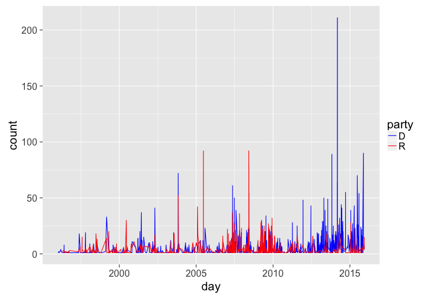

<!--
%\VignetteEngine{knitr}
%\VignetteIndexEntry{rsunlight vignette}
%\VignetteEncoding{UTF-8}
-->


rsunlight vignette - Interface to Sunlight Labs APIs
=====================================================

`rsunlight` is an R package to search and retrieve data from the Sunlight Labs APIs. 

Returned objects from functions are simple lists. That is, you likely will want to take output objects and make data.frames, vectors, matrices, etc. In future versions of rsunlight, I will return data.frame's when possible as those are easy to work with in R for beginners, though advanced users may prefer lists or raw responses from the API with lots of info, including header, etc.

## Installation


```r
devtools::install_github("ropengov/rsunlight")
```


```r
library('rsunlight')
```

## Congress API

### Gets details (subcommittees + membership) for a committee by id.


```r
cg_committees(id = 'JSPR')
```

```
#> <Sunlight data>
#>    Dimensions:   [20 X 5]
#> 
#>    chamber committee_id
#> 1   senate       SSGA19
#> 2   senate       SSGA18
#> 3   senate       SSGA16
#> 4   senate       SSGA15
#> 5   senate       SSGA17
#> 6   senate       SSGA01
#> 7   senate       SSFR14
#> 8   senate       SSFR15
#> 9   senate       SSFR13
#> 10  senate       SSFR12
#> ..     ...          ...
#> Variables not shown: name (chr), parent_committee_id (chr), subcommittee
#>      (lgl)
```

### Get districts for a latitude/longitude.


```r
cg_districts(latitude = 35.778788, longitude = -78.787805)
```

```
#> <Sunlight data>
#>    Dimensions:   [1 X 2]
#> 
#>   state district
#> 1    NC        2
```

### Get districts that overlap for a certain zip code.


```r
cg_districts(zip = 27511)
```

```
#> <Sunlight data>
#>    Dimensions:   [3 X 2]
#> 
#>   state district
#> 1    NC        2
#> 2    NC        4
#> 3    NC       13
```

### Search politicians by name


```r
cg_legislators(last_name = 'Reed')
```

```
#> <Sunlight data>
#>    Dimensions:   [2 X 36]
#> 
#>   bioguide_id   birthday chamber
#> 1     R000585 1971-11-18   house
#> 2     R000122 1949-11-12  senate
#> Variables not shown: contact_form (chr), crp_id (chr), district (int),
#>      facebook_id (chr), fax (chr), fec_ids (list), first_name (chr),
#>      gender (chr), govtrack_id (chr), icpsr_id (int), in_office (lgl),
#>      last_name (chr), middle_name (chr), name_suffix (chr), nickname
#>      (chr), oc_email (chr), ocd_id (chr), office (chr), party (chr), phone
#>      (chr), state (chr), state_name (chr), term_end (chr), term_start
#>      (chr), thomas_id (chr), title (chr), twitter_id (chr), votesmart_id
#>      (int), website (chr), youtube_id (chr), lis_id (chr), senate_class
#>      (int), state_rank (chr)
```

### Search politicians by zip code

And get their names and Twitter handles


```r
cg_legislators(zip = 77006)
```

```
#> <Sunlight data>
#>    Dimensions:   [4 X 37]
#> 
#>   bioguide_id   birthday chamber
#> 1     C001098 1970-12-22  senate
#> 2     P000592 1948-09-10   house
#> 3     J000032 1950-01-12   house
#> 4     C001056 1952-02-02  senate
#> Variables not shown: contact_form (chr), crp_id (chr), district (int),
#>      facebook_id (chr), fax (chr), fec_ids (list), first_name (chr),
#>      gender (chr), govtrack_id (chr), icpsr_id (int), in_office (lgl),
#>      last_name (chr), lis_id (chr), middle_name (lgl), name_suffix (lgl),
#>      nickname (lgl), oc_email (chr), ocd_id (chr), office (chr), party
#>      (chr), phone (chr), senate_class (int), state (chr), state_name
#>      (chr), state_rank (chr), term_end (chr), term_start (chr), thomas_id
#>      (chr), title (chr), twitter_id (chr), votesmart_id (int), website
#>      (chr), youtube_id (chr), leadership_role (chr)
```

## Capitol Words API

### Popularity of a phrase through time.

Get a list of how many times the phrase "united states" appears in the Congressional Record in each month between January and June, 2010:


```r
cw_timeseries(phrase='united states', start_date='2009-01-01', end_date='2009-04-30', granularity='month')
```

```
#> <Sunlight data>
#>    Dimensions:   [4 X 2]
#> 
#>   count      month
#> 1  3805 2009-01-01
#> 2  3512 2009-02-01
#> 3  6018 2009-03-01
#> 4  2967 2009-04-01
```

#### Plot data


```r
library('ggplot2')
dat <- cw_timeseries(phrase = 'climate change')
ggplot(dat, aes(day, count)) + 
  geom_line() + 
  theme_grey(base_size=20)
```

 

#### Plot more data


```r
dat_d <- cw_timeseries(phrase='climate change', party="D")
dat_d$party <- rep("D", nrow(dat_d))
dat_r <- cw_timeseries(phrase='climate change', party="R")
dat_r$party <- rep("R", nrow(dat_r))
dat_both <- rbind(dat_d, dat_r)
ggplot(dat_both, aes(day, count, colour=party)) + 
  geom_line() + 
  theme_grey(base_size=20) + 
  scale_colour_manual(values=c("blue","red"))
```

 

## Open States API

### Search OpenStates bills.


```r
os_billsearch(terms = 'agriculture', state = 'tx', chamber = 'upper')
```

```
#> <Sunlight data>
#>    Dimensions:   [320 X 10]
#> 
#>                                                                          title
#> 1  Relating to certain committees and programs to develop the wine industry in
#> 2  Relating to a waiver of fees by the Department of Agriculture and the Parks
#> 3  Urging the United States Department of Agriculture Food and Nutrition Servi
#> 4  Relating to the designation of an office in the Department of Agriculture t
#> 5  Relating to the office of water and the water advisory committee in the Dep
#> 6  Relating to establishing an agriculture ombudsman office in the Department 
#> 7  Relating to authorizing the issuance of revenue bonds to fund capital proje
#> 8  Relating to authorizing the issuance of revenue bonds to fund capital proje
#> 9  Relating to authorizing the issuance of revenue bonds to fund capital proje
#> 10 Relating to authorizing the issuance of revenue bonds to fund capital proje
#> ..                                                                         ...
#> Variables not shown: created_at (chr), updated_at (chr), id (chr), chamber
#>      (chr), state (chr), session (chr), type (list), subjects (list),
#>      bill_id (chr)
```

### Search Legislators on OpenStates


```r
os_legislatorsearch(state = 'tx', party = 'democratic', active = TRUE)
```

```
#> <Sunlight data>
#>    Dimensions:   [63 X 29]
#> 
#>    last_name          updated_at nimsp_candidate_id         full_name
#> 1   Naishtat 2015-12-16 09:56:01             112047  Elliott Naishtat
#> 2     Romero 2015-12-16 09:56:01                 NA Ramon Romero, Jr.
#> 3   Minjarez 2015-12-16 09:56:01                 NA      Ina Minjarez
#> 4  Gutierrez 2015-12-16 09:56:01             111938  Roland Gutierrez
#> 5     Israel 2015-12-16 09:56:01                 NA      Celia Israel
#> 6    Coleman 2015-12-16 09:56:01              99959    Garnet Coleman
#> 7    Guillen 2015-12-16 09:56:01             111937      Ryan Guillen
#> 8    Johnson 2015-12-16 09:56:01                 NA      Eric Johnson
#> 9      Moody 2015-12-16 09:56:01             100029      Joseph Moody
#> 10    Turner 2015-12-16 09:56:01             112130  Sylvester Turner
#> ..       ...                 ...                ...               ...
#> Variables not shown: +district_address (chr), first_name (chr),
#>      middle_name (chr), district (chr), id (chr), state (chr),
#>      votesmart_id (chr), party (chr), all_ids (list), leg_id (chr), active
#>      (lgl), transparencydata_id (chr), photo_url (chr), +capital_address
#>      (chr), url (chr), country (chr), created_at (chr), level (chr),
#>      nimsp_id (chr), chamber (chr), offices (list), suffixes (chr), email
#>      (chr), nickname (chr), +birth_date (chr)
```
